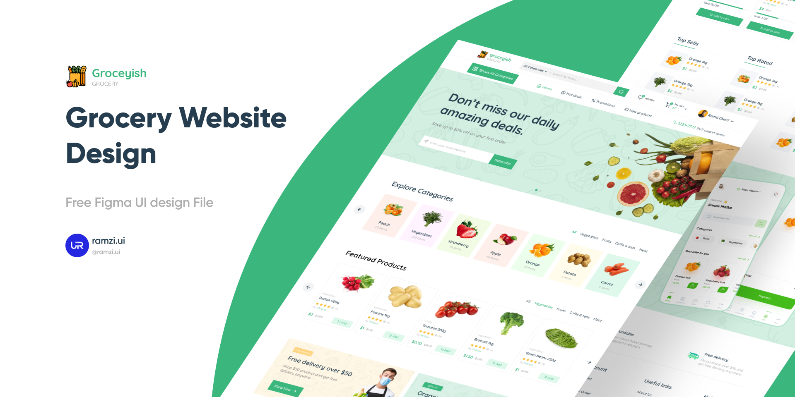

# Grocery-Website

This project is an excuse to learn modern web frameworks.

## Project goals

1. Create a website based on [this](https://www.figma.com/community/file/1094388281253753863) design by [Ramzi Cherif](https://www.figma.com/@ramzi_ui)
2. Tech stack considerations currently include Svelte or React for the front end, and Expressjs + MongoDB on the backend.

## Design

## Todo

### Front-end

- [ ] Implement site components using React or Svelte

#### Header components

- [x] Logo
- [x] Search
- [x] Wishlist
- [ ] Cart
- [ ] Profile

#### Nav components

- [ ] Button-w-icon
- [ ] Nav-item-w-icon

#### Hero components

- [ ] Subscribe

#### Shared components

- [ ] Carousel-Slider
- [ ] Arrow-Button
- [ ] Rating-Stars

#### Explore-Catagories components

- [ ] Item-Catagory-Card-Small
  
#### Featured-Product components

- [ ] Item-Card-Style-1

#### Daily Best Sellers components

- [ ] Item-Card-Style-2
- [ ] New-User-Signup-Card
- [ ] Form-Item

#### Small item lists

- [ ] Item-Card-Style-3

#### App Hero Section

- [ ] Appstore-Button

#### Marketing Information

- [ ] Marketing-Item

#### Footer

- [ ] Contact-Information
- [ ] Links-Section
- [ ] CC-List
- [ ] Social-List

### Back-end

- [ ] Implement API using REST or GraphQL

#### Create Schema for

- [ ] Users
- [ ] Store Items
- [ ] Contact info
- [ ] Accepted payment methods
- [ ] Social Media Items
